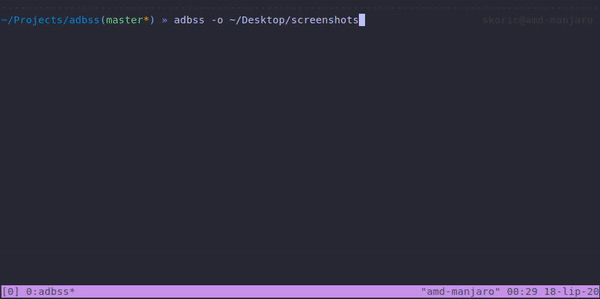

# adbss 

**A**ndroid **D**ebug **B**ridge **S**creen**S**hoter

*Small bash script for easy screenshot taking on Android devices/emulators*

The `adbss.sh` is a small bash script that will allow you to interactively take screenshots on your connected Android device or emulator. 

### Features

- Take a screenshot from connected device/emulator with one key press
- Specify an output directory for the saved screenshots
- Automatically clean the temporary screenshot from the device

### Sample

See the sample of screenshot taking process:



### Options

* **-o** Specify output directory for screenshots, e.g. `adbss -o ~/Desktop/test_dir`
* **-h** Print help.

### Installation (Linux and MacOS)

1) Make sure you have ADB in your path. You can add it to your shell config file (`.bash_profile`, `.zshrc`, etc.):

```sh
# Your ADB might be different, these are just common locations.

# Linux
export PATH=${PATH}:$HOME/Android/Sdk/platform-tools/

# MacOS
export PATH=${PATH}:$HOME/Library/Android/sdk/platform-tools/
```

2) Check that you have a device/emulator connected to the ADB by running `adb devices`. Output should look like this:

```sh
List of devices attached
emulator-5554   device 
```

3) You can simply download `adbss.sh` and call it however you like. This is simpler example for nicer integration and easier updates:

```sh
# Clone adbss repo to your home directory.
git clone https://github.com/skoric/adbss.git ~/adbss

# Create alias in your shell config file ('.bash_profile', '.zshrc', etc.).
echo "alias adbss=\"sh $HOME/adbss/adbss.sh\"" >> ~/.zshrc

# Reload configuration.
source ~/.zshrc

# Start taking screenshots.
adbss
```
